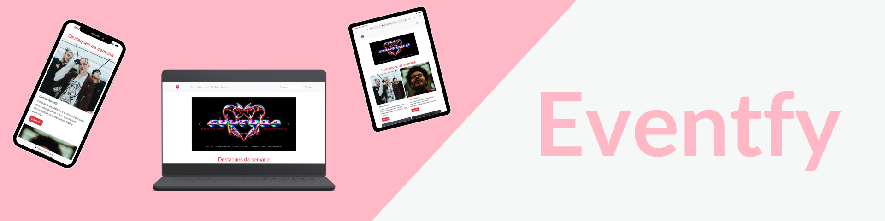

### Curso Técnico de Desenvolvimento de Sistemas - Senai Itapeva
# EVENTFY
**Descrição:**
O objetvo do projeto é criar um site completo para a divulgação de eventos. Seja música, teatro, exposições de arte, festivais, até mesmo eventos com objetivos acadêmicos, religiosos ou no mercado de trabalho.
## Índice
- Funcionalidades 
- Tecnologias Utilizadas
- Autores
- Licença
## Funcionalidades
-cadastrar eventos
-página de cadastro e login
-página sobre
## Tecnologias Utilizadas
- **Linguagem/Frameworks:**

## Autores
- Ana Paula Maximo - GitHub - github.com/AnaPaulaMaximo
## Licença
Este projeto está licenciado sob a Licença MIT - veja o arquivo LICENSE para mais detalhes.